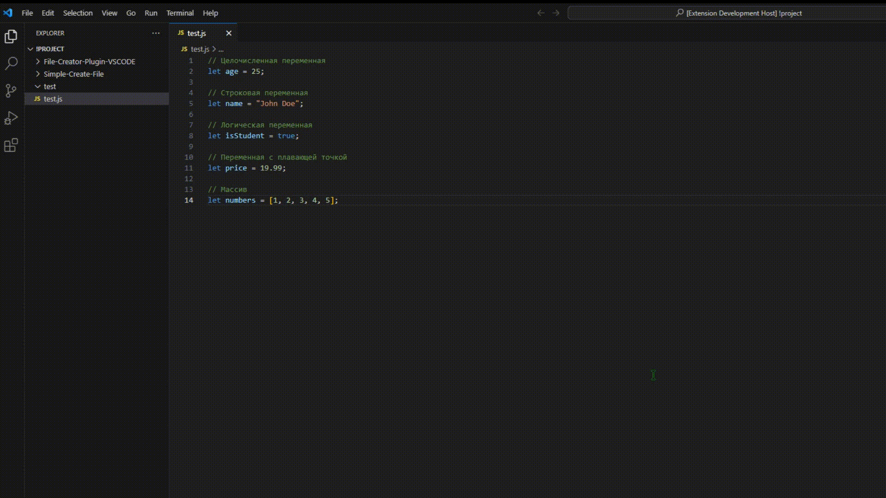

## Simple Create File
Расширение для Visual Studio Code, которое позволяет создавать файлы различных типов с помощью быстрого выбора.

## Установка
Откройте Visual Studio Code.
Перейдите во вкладку "Extensions" (Расширения) в боковой панели.
Введите "Simple Create File" в поле поиска.
Найдите расширение "Simple Create File" и нажмите кнопку "Install" (Установить).
После установки расширение будет готово к использованию.
## Использование
Откройте Visual Studio Code в рабочей области, в которой вы хотите создать файл.
Вызовите командную палитру, нажав клавиши Ctrl+Shift+P (Windows/Linux) или Cmd+Shift+P (Mac).
Введите "Simple Create File: Show Create File Menu" и выберите эту команду.
Появится окно быстрого выбора с доступными вариантами создания файлов.
Выберите нужный тип файла, например, "Создать файл Python" или "Создать файл JSON".
Введите имя файла во всплывающем окне и нажмите Enter.
Файл будет создан в корне рабочей области с выбранным типом и указанным именем.
Появится информационное сообщение о успешном создании файла.
## Примеры
Создание файла Python
Выберите опцию "Создать файл Python" в окне быстрого выбора, введите имя файла (без расширения) и нажмите Enter. Будет создан файл с расширением .py в корне рабочей области.

Создание файла JSON
Выберите опцию "Создать файл JSON" в окне быстрого выбора, введите имя файла (без расширения) и нажмите Enter. Будет создан файл с расширением .json в корне рабочей области.

## Заключение
Расширение Simple Create File упрощает создание файлов различных типов в Visual Studio Code. Оно позволяет быстро создавать файлы Python, JSON и других типов, что может быть полезно при разработке проектов. Расширение легко установить и использовать, обеспечивая удобство и эффективность в работе с файлами.